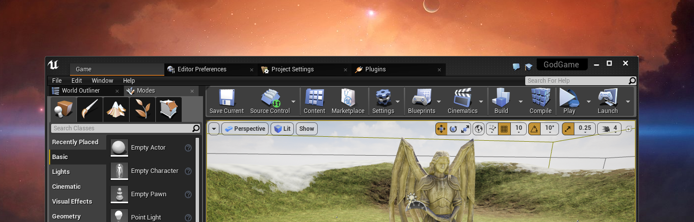
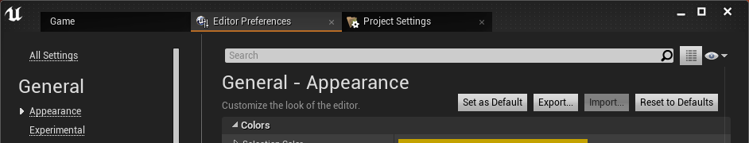
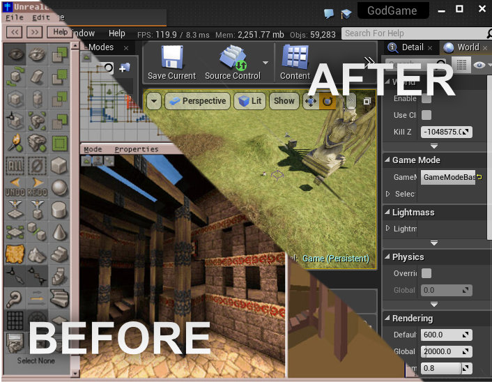
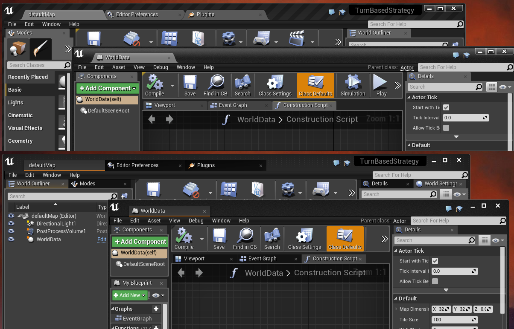

# LazyTheme
This is images-only replacement for a more pleasant UI look of the editor.

( [Also available in pink](https://github.com/Xerios/LazyTheme/tree/pink) thanks to [matzar](https://github.com/matzar) & Justin Meisse )

## How to install?
Copy paste to your UnrealEngine folder, the path should match and you should normally end up replacing existing files.
That's it !

### 4.16 notes
The background of the window won't be replaced automatically, you can change it through the *Editor Preferences* > *Appearance* > *Colors* > **Editor Main Window Background Override** ( Set it to your own image or replace it by black, which also looks good )

## What changed?
* Only Images: Tabs and Windows buttons ( close, minimize, etc.. ), and few other small things.
* No code was touched during creation of this lazy work.

## Can I have a screenshot that compares with the original theme?
Of course!

## No, I mean the current theme not the original one.
Should've told me!

## Which version did you use?
Unreal Engine 4.16
